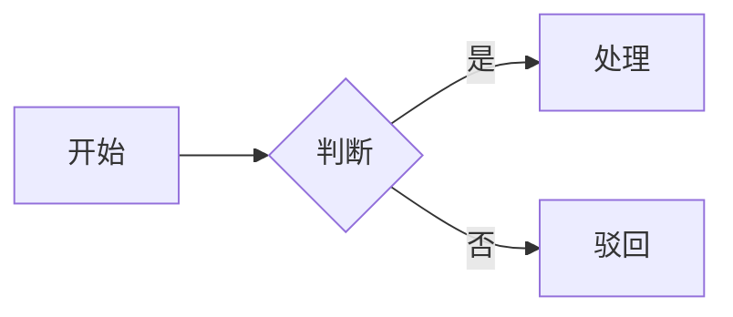

# <项目/模块名> 需求规格说明书

| 项 | 内容 |
| --- | --- |
| 文档版本 | V1.0 |
| 编制人 | |
| 编制日期 | YYYY-MM-DD |
| 文档密级 | 内部 |
| 资料依据 | input/INDEX.md（截止 YYYY-MM-DD） |

> 甲方或公司有既定模板时，以对方模板为骨架，本模板只作内容参考。

---

## 0. 未决问题汇总

评审时**先过这张表**。表里还有未确认项，说明相关章节的规则可能变动。

| # | 问题 | 影响范围 | 责任人 | 状态 |
| --- | --- | --- | --- | --- |
| Q1 | | | | 待确认 |

## 1. 背景与目标

### 1.1 业务背景
（为什么做这件事，当前的痛点是什么）

### 1.2 目标与成功标准
（要达成什么业务结果，怎么衡量。能量化就量化）

### 1.3 目标用户
| 角色 | 描述 | 核心诉求 | 使用频次 |
| --- | --- | --- | --- |

## 2. 范围

### 2.1 本期范围
| 模块 | 功能 | 优先级 | 优先级状态 |
| --- | --- | --- | --- |
| | | P0 | 已确认 / 建议值 |

### 2.2 本期明确不做
| 不做的内容 | 原因 | 计划何时做 |
| --- | --- | --- |

> 这一节不能省。写清不做什么，是后期防止范围蔓延和扯皮的主要依据。

### 2.3 依赖与前置条件
| 依赖项 | 类型 | 当前状态 | 责任方 | 风险 |
| --- | --- | --- | --- | --- |
| | 外部接口 / 数据 / 环境 / 决策 | | | |

## 3. 业务流程

### 3.1 整体流程
（用 mermaid 或分步文字描述端到端流程；跨角色流程要标清每步谁做）

### 3.2 关键分支与异常流程
（主流程之外的分支：驳回、超时、并发冲突、数据缺失时怎么走）

## 4. 功能需求

> 每个功能一节，编号与 `output/analysis/需求拆解.md` 中的需求 ID 对齐。

### 4.1 <功能名>（R-xxx-001）

**用户目标**：<谁> 为了 <什么价值> 需要 <做什么>

**来源**：（资料路径 + 章节。推断标 `[推断]`，我方建议标「新增建议」）

**业务规则**

1. （每条都要能转成判断条件，写清边界值和例外）

**状态流转**

| 当前状态 | 操作 | 谁能做 | 目标状态 | 前置条件 |
| --- | --- | --- | --- | --- |

**字段定义**

| 字段 | 类型 | 必填 | 长度/范围 | 默认值 | 校验规则 | 说明 |
| --- | --- | --- | --- | --- | --- | --- |

（枚举字段列全取值并说明每个值的业务含义）

**界面约束**（不画像素，只写承载什么信息、有哪些操作、怎么排布优先级）

**四类状态**

| 状态 | 表现 |
| --- | --- |
| 空态 | |
| 加载中 | |
| 错误 | |
| 无权限 | |

**验收标准**

1. （可验证，能判断做完了没有）

**未决**：（有的话标 ⚠ 并指向 Q 编号）

## 5. 权限矩阵

| 功能 / 角色 | 角色A | 角色B | 角色C |
| --- | --- | --- | --- |
| 查看 | ✓ | ✓ | — |
| 编辑 | ✓ | — | — |
| 删除 | — | — | — |

（`—` 表示无权限时的表现要写明：隐藏还是置灰）

## 6. 数据需求

### 6.1 核心数据实体与关系
### 6.2 存量数据与迁移
（有存量数据要写明量级、质量问题、清洗规则、迁移口径）
### 6.3 统计与报表口径
（统计类需求必须写清口径：时间范围按什么对齐、去重规则、汇总维度）

## 7. 非功能需求

| 类别 | 要求 | 验收方式 |
| --- | --- | --- |
| 性能 | | |
| 并发 | | |
| 可用性 | | |
| 兼容性 | | |
| 安全与合规 | | |
| 审计留痕 | | |

> 写成能验收的形式。「响应时间要快」无法验收，「列表页首屏 P95 < 2s（1 万条数据）」可以。

## 8. 风险与遗留问题

| 风险 | 影响 | 可能性 | 应对 | 责任人 |
| --- | --- | --- | --- | --- |

## 9. 需求追溯矩阵

| 需求 ID | 章节 | 来源资料 | 位置 | 状态 |
| --- | --- | --- | --- | --- |

> 反向也要检查：资料里写了但本文档没覆盖的内容，要么补进来，要么写进 §2.2「明确不做」。

## 附录

- A. 术语表（项目特有名词、缩写、业务黑话）
- B. 参考资料清单（见 `input/INDEX.md`）
- C. 变更记录

| 版本 | 日期 | 修改内容 | 修改人 |
| --- | --- | --- | --- |
