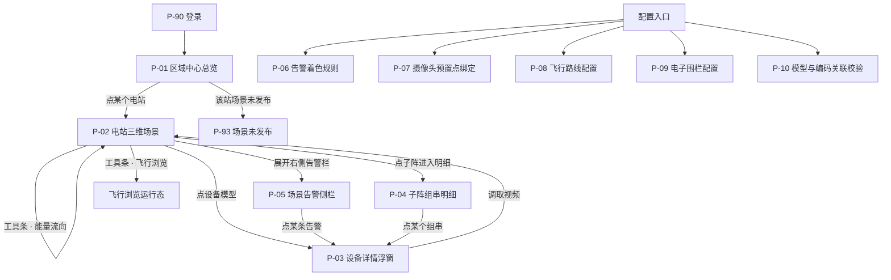

# 数字孪生可视化 原型输入说明

> 编写日期：2026-07-31 ｜ 输入：[数字孪生可视化需求规格说明书.md](../docs/数字孪生可视化需求规格说明书.md)、
> [需求拆解.md](./需求拆解.md)
> **用途**：作为需求输入喂给 Axhub Make 生成可点击原型。
> `prototypes/` 目录由 Axhub Make 自行构建，本说明不往里放任何文件。

## 0. 给工具的总体交代

- **行业与形态**：新能源（光伏）场站的数字孪生监视平台。
  **主体是一块常驻的三维场景画布，所有业务 UI 都是叠在画布上的浮层**——
  这与常规后台管理系统「左导航 + 右表格」的形态完全不同，不要按后台模板生成。
- **端形态**：桌面优先（最小支持 1440×900），值班室大屏常驻；
  资料提到「可在移动设备和浏览器上运行」，故弹窗与列表类浮层需响应式。
- **三维画布本身不用真实渲染**：原型阶段用静态占位图 + 层级切换效果表达即可，
  重点是**画布之上的信息层与交互**：下钻路径、浮层布局、状态标识、配置表单。
- **色彩约束**：数字孪生场景通常是深色背景，但**状态不能只靠颜色单通道**传达——
  告警级别、数据过期、未接入、已降级这些状态必须同时有文字标识。
- **不要生成的内容**：人员相关的一切页面（人员属性、位置、路径导航、路径回放、
  到岗录像）、电子围栏的越界报警页、一键派单页、风电场专有页面、
  第 3 章特色功能页（告警 AI 治理、智能巡视、热斑识别）。原因见决策
  [0001](../decisions/0001-PRD首版只覆盖数字孪生可视化模块.md)、
  [0002](../decisions/0002-人员定位类功能暂缓至个人信息合规方案明确.md)。

## 1. 页面清单

| 页面 ID | 页面名 | 所属模块 | 承载功能 | 用户角色 | 优先级 |
| --- | --- | --- | --- | --- | --- |
| P-01 | 区域中心总览 | 三维可视化 | R-可视-001 | 运营管理人员 | P0 |
| P-02 | 电站三维场景（主场景） | 三维可视化 | R-可视-001/002/003/004/005 | 全部 | P0 |
| P-03 | 设备详情浮窗 | 运行可视化 | R-运行-001、R-运行-002 | 全部 | P0 |
| P-04 | 子阵组串明细 | 运行可视化 | R-运行-002 | 运维值班人员 | P0 |
| P-05 | 场景告警侧栏 | 告警着色 | R-可视-005 | 运维值班人员 | P1 |
| P-06 | 告警着色规则配置 | 配置 | R-可视-005 | 三维数据工程师 | P1 |
| P-07 | 摄像头预置点绑定 | 视频集成 | R-视频-001 | 三维数据工程师 | P1 |
| P-08 | 飞行路线配置 | 三维可视化 | R-可视-003 | 运营 / 三维数据工程师 | P1 |
| P-09 | 电子围栏配置 | 安全 | R-围栏-001 | 安全管理人员 | P2 |
| P-10 | 模型与编码关联校验 | 建模依赖 | R-建模-003 | 三维数据工程师 | P0 |
| P-90 | 登录 | 系统 | — | 全部 | P0 |
| P-91 | 无权限提示 | 系统 | — | 全部 | P0 |
| P-92 | 页面不存在（404） | 系统 | — | 全部 | P1 |
| P-93 | 场景未发布 / 空数据引导 | 系统 | — | 三维数据工程师 | P1 |

### 反向检查

**每条 P0 需求都落到页面了吗？**

| P0 需求 | 落在哪 | ✓ |
| --- | --- | --- |
| R-可视-001 场景分层加载 | P-01、P-02 | ✓ |
| R-运行-001 设备属性查看 | P-03 | ✓ |
| R-运行-002 组串级实时数据 | P-03、P-04 | ✓ |
| R-建模-003 KKS 编码关联 | P-10（校验视图；编码维护本身不在本批） | ✓ |

**边角页面**：登录、无权限、404、场景未发布均已列入（P-90~P-93）。
其中 **P-93「场景未发布」是本项目特有的空态**——三维成果没交付前，
系统是打得开但看不到东西的，这个状态必须有页面，不能留白屏。

## 2. 信息架构

> **导航形态说明**：P-02 是常驻主场景，其余业务视图以浮层 / 侧栏形式叠加，
> **不做整页跳转**（跳走再回来意味着场景重新加载，值班场景不能接受）。
> 只有配置类页面（P-06~P-10）走独立页面。

## 3. 主流程点击路径

### 流程一：值班员从一条告警定位到出问题的组串

1. **P-02 电站三维场景** → 右侧告警侧栏收起状态下显示告警计数徽标
   （形如「告警 7」，徽标带文字不只用颜色）
2. 点击徽标 → 展开 **P-05 场景告警侧栏**，按级别分组列出当前告警
3. 场景中对应模型已处于着色状态；**着色模型旁带文字标识**（如「告警」），
   不是只有颜色变化
4. 点击侧栏某条告警 → 场景自动飞向该设备并逐级下钻（电站 → 分区 → 子阵 → 设备），
   途中显示层级面包屑变化
5. 到位后自动弹出 **P-03 设备详情浮窗**，分「设备基础数据」「设备实时数据」两组
6. 实时数据区显示数据时间戳；**若已过期，显示「数据过期 · 最后更新 HH:MM:SS」**，
   数值置为次要样式，不伪装成实时
7. 点浮窗内「查看同子阵组串」→ 打开 **P-04 子阵组串明细**，
   异常组串排在列表最前，正常组串在后
8. 关闭浮层 → 回到 P-02，**场景保持在当前层级，不跳回初始视角**

### 流程二：三维数据工程师排查「点了没数据」的模型

1. 值班员反馈某设备点了弹空窗 → 工程师进 **P-10 模型与编码关联校验**
2. 页面顶部两个指标卡：「未关联模型 12」「未关联设备 5」，各自可点击
3. 点「未关联模型 12」→ 列表列出模型编号、所属层级、模型类型、入库时间
4. 选中某条 → 右侧详情给出该模型在场景中的位置，并提供「定位到场景」按钮
5. 点「定位到场景」→ 跳到 **P-02** 并高亮该模型
6. 回到 P-10 → 顶部还有一张「未着色告警」清单入口，
   列出 KKS 在模型库中不存在的告警——**这些告警不会在场景里显示，必须能被发现**

### 流程三：远程管控人员点设备调视频

1. **P-02** → 点击某台箱变模型 → **P-03 设备详情浮窗**
2. 浮窗底部有「调取视频」按钮 → 点击
3. 场景内浮出视频画面小窗，摄像头转向该设备，小窗标题显示摄像头名称与预置点名称
4. **失败路径**：摄像头离线时，小窗位置显示「摄像头离线，无法调取」+ 摄像头名称，
   **不显示上一次的画面**（这是本流程最重要的一条，要在原型里明确表达出来）
5. 小窗可拖动、可放大、可关闭；关闭后场景与浮窗状态不变

### 流程四：无权限角色尝试配置（权限差异演示）

1. 以「运维值班人员」身份登录 → **P-01** → **P-02**
2. 顶部工具条中「配置」入口**可见但置灰**，悬停提示「需要三维数据工程师角色」
3. 直接访问 P-06 的 URL → 进入 **P-91 无权限提示**页，
   说明所需角色并提供「返回主场景」按钮
4. 对比：无权限**场站**在 P-01 中**根本不出现**（数据权限走隐藏，操作权限走置灰）

## 4. 每页详情

### P-01 区域中心总览

- **页面目标**：运营管理人员一眼看清所辖各场站今天有没有问题。
- **信息优先级**：① 有告警的场站（最重要）② 各站运行概况 ③ 场景可用性
- **区块**：
  - 地图 / 分布图：各场站以图标落位，告警站有文字 + 视觉双通道标识
  - 场站卡片列表：站名、装机容量、当前出力、告警计数、场景状态（已发布 / 未发布）
- **操作**：点击场站进入 P-02；场景未发布的站点击后进 P-93
- **四类状态**：
  - 空态：「暂无可查看的场站」+ 说明可能原因（无数据权限 / 尚未配置）
  - 加载中：卡片骨架占位，**保留上次数据**
  - 错误：顶部常驻错误条，区分「数据源故障」与「查询故障」，附重试
  - 无权限：无权限场站**不出现在列表中**（隐藏）
- **权限差异**：全部角色可看；数据按场站权限隔离

### P-02 电站三维场景（主场景）

**这是整个原型的核心页面，其余页面都围绕它。**

- **页面目标**：在一块画布上完成浏览、下钻、定位、查看四件事。
- **布局**：
  - 主体：三维场景画布（原型用静态占位图，按层级准备 5 张：区域中心 / 电站 / 分区 / 子阵 / 设备）
  - 顶部：层级面包屑（区域中心 › XX 电站 › 3 分区 › 12 子阵 › 69#箱变），任一级可点回
  - 顶部右：工具条 —— 图层开关、昼夜切换、天气切换、能量流向开关、飞行浏览、配置入口
  - 左侧：图层树（地形、影像、建筑、发电设施、绿化、线路、标签），可独立开关
  - 右侧：告警侧栏（默认收起，见 P-05）
  - 底部：加载进度条（分级加载时显示「正在加载：子阵层 3/12」）
- **交互要点**：
  - 放大 / 缩小 / 平移三项基本操作必须有
  - 下钻通过点击场景对象或面包屑完成，**下钻不重载整页**
  - 层级模型缺失时，加载到上一可用层级并在底部提示「12 子阵层模型缺失」
- **四类状态**：
  - 空态：该站场景未发布 → 跳 P-93
  - 加载中：**保留已加载层级，不清空画面**；进度可见
  - 错误：地形可用而模型不可用时**降级展示地形**并提示，不是白屏
  - 无权限：无权限场站进不来（在 P-01 就已隐藏）
- **权限差异**：配置入口对非工程师角色置灰并提示所需角色

### P-03 设备详情浮窗

- **页面目标**：判断这台设备是什么、现在什么状态。
- **形态**：浮层，**不是整页**；可拖动、可关闭；关闭后场景状态不变
- **两区**（顺序不可颠倒）：
  - **设备基础数据**：KKS 编码、设备名称、设备类型、厂商名称、安装日期、
    运行日期、接入状态、所属子阵、所属场站、维护记录、数据更新时间
  - **设备实时数据**：设备状态、有功功率、无功功率、功率因数、电网频率、油温、
    数据时间戳
- **关键表达**（原型必须体现，否则这一页没做出价值）：
  - 两区**各自标注更新时间**，不共用一个
  - 无值项显示「-」，与数值 0 明确区分
  - 接入状态为「未接入」时，实时数据区整体显示「未接入」，**不显示 0**
  - 数据过期时显示「数据过期 · 最后更新 HH:MM:SS」，数值转次要样式
  - **模型未关联设备时**：浮窗显示「该模型未关联设备」+ 模型编号 + 「反馈给数据工程师」入口，
    **不弹空白窗**
- **操作**：查看同子阵组串（跳 P-04）、调取视频（见流程三）、关闭
- **权限差异**：维护人员姓名字段 ⚠ 暂不展示（→ Q5），原型中留位并标注「合规确认后开放」

### P-04 子阵组串明细

- **页面目标**：把一个子阵下的组串一次看完，异常的排在前面。
- **形态**：侧滑面板或浮层表格，**不脱离主场景**
- **列**：组串编号、设备状态、有功功率、数据时间戳、是否过期、所属逆变器
- **默认排序**：异常状态在前，其余按编号升序
- **筛选**：设备状态、是否过期
- **关键点**：组串数量可能很大（→ Q16），列表需支持虚拟滚动与快速定位到某编号
- **四类状态**：空态「该子阵暂无组串数据」；加载中不清空已有行
- **权限差异**：全部角色可看，无编辑操作

### P-05 场景告警侧栏

- **页面目标**：把当前场景里的告警集中列出来，点一条就飞过去。
- **形态**：右侧可收起侧栏；收起时只留计数徽标（带文字）
- **分组**：按告警级别分组 ⚠（级别定义待 Q15，原型先按「一级/二级/三级」占位并标注）
- **每行**：级别标签（文字 + 形状双通道）、设备名称、KKS 编码、告警类型、发生时间、是否已着色
- **关键点**：**「未着色告警」单独分组置底**——KKS 匹配不到模型的告警，
  在场景里看不见，必须在这里能被看见
- **操作**：点击某条 → 场景飞向该设备并弹 P-03
- **四类状态**：空态「当前无告警」+ 最近数据更新时间（必须证明系统在工作）
- **权限差异**：全部角色可看

### P-06 告警着色规则配置

- **页面目标**：三维数据工程师定义「什么告警在场景里显示成什么样」。
- **结构**：左侧规则列表，右侧规则编辑
- **表单字段**：告警级别（必选 ⚠ 待 Q15）、告警类型（必选 ⚠ 待 Q15）、渲染颜色（必选）、
  文字标识（必填 1–10 字）、是否闪烁（默认否）、生效层级（多选，必选）
- **强约束**：**文字标识为必填**——原型中不允许出现「只配颜色就能保存」的路径，
  这是可访问性要求落到表单上的体现
- **操作**：新建、编辑、删除（需二次确认）、启用/停用；保存后即时生效
- **预览**：编辑区提供一个小预览块，展示该规则下模型的着色 + 文字标识效果
- **权限差异**：仅三维数据工程师可进入，其他角色走 P-91

### P-07 摄像头预置点绑定

- **页面目标**：把设备模型和摄像头预置点对应起来。
- **结构**：左侧设备树（场站 → 分区 → 子阵 → 设备），右侧该设备已绑定的预置点列表
- **列**：摄像头名称、预置点名称、绑定时间、绑定人、摄像头在线状态
- **操作**：新增绑定（选摄像头 → 选预置点 → 保存）、解除绑定（需二次确认）、测试调用
- **关键点**：一个设备可绑定多个预置点；「测试调用」失败时**明确提示失败原因**
- **四类状态**：空态「该设备尚未绑定预置点」+ 新增入口
- **权限差异**：仅三维数据工程师

### P-08 飞行路线配置

- **页面目标**：定义一条能把全站看一遍的巡视路线。
- **表单字段**：路线名称（必填 1–50）、视角类型（单选：上帝视角 / 第一视角，必填）、
  途经点（有序列表，至少 2 个，可拖动排序）、每点停留时长、覆盖层级（多选）
- **操作**：新建、编辑、删除（需二次确认）、预览（跳 P-02 并进入飞行运行态）
- **飞行运行态**（在 P-02 上表现）：顶部显示「飞行浏览中 · 第 3/12 点」+ 暂停 / 停止按钮；
  **停止后停留在当前视角，不跳回初始位置**
- **权限差异**：运营管理人员与三维数据工程师可配置

### P-09 电子围栏配置

- **页面目标**：把安全边界画在场景里，且改了能查到。
- **结构**：场景中绘制围栏范围 + 右侧属性表单
- **表单字段**：围栏名称（必填）、生效时段、启用状态（新建默认停用）、备注
- **操作**：绘制、编辑、启用/停用（启用需二次确认）、删除（需二次确认）
- **必须有的一块**：**变更历史**——谁改的、什么时间、改成什么，可查询
- **明确不做**：越界报警设置、报警接收人配置、录像联动配置（→ Q5、Q14）。
  原型中该区域留位并标注「合规方案确认后开放」，**不要画成灰按钮**（会被误读为将来一定做）
- **权限差异**：仅安全管理人员

### P-10 模型与编码关联校验

- **页面目标**：让「点了没数据」这类问题能被主动发现，而不是等用户报。
- **顶部三张指标卡**：未关联模型数、未关联设备数、未着色告警数（各自可点击下钻）
- **三张清单**：
  - 未关联模型：模型编号、所属层级、模型类型、入库时间 → 「定位到场景」
  - 未关联设备：KKS 编码、设备名称、所属子阵 → 说明缺哪个模型
  - 未着色告警：告警的 KKS、设备名称、发生时间 → 说明模型库中查无此码
- **操作**：导出清单、定位到场景
- **四类状态**：空态「关联完整，无异常」——这是正向状态，要做得像「体检通过」
- **权限差异**：仅三维数据工程师

### P-90～P-93 系统页面

| 页面 | 要点 |
| --- | --- |
| P-90 登录 | 用户名 + 密码；⚠ 是否对接甲方统一认证未知，原型按独立登录做 |
| P-91 无权限 | 明确说明**所需角色**（不只是「无权限」），提供返回主场景入口 |
| P-92 404 | 说明页面不存在，提供返回区域中心 |
| P-93 场景未发布 | 本项目特有：说明该站三维成果尚未交付，给出已发布场站的入口；**不要白屏** |

## 5. 视觉与设计约束

- **无参考截图可用**：方案资料原带的 19 张配图因含真实设备厂商名、KKS 实例编码与
  真实地形影像，已在开源示例中移除（见 [input/INDEX.md](../../input/INDEX.md) 人工批注）。
  转换稿中保留了每张图的文字描述，可作为**布局意图**的参考，但**没有可对齐的视觉稿**。
- **无既有设计规范**：资料未提供任何 UI 规范、色板或组件库。⚠ 需向甲方确认是否有集团级规范。
- **三维为主、UI 为辅**：画布占满，业务 UI 是浮层与侧栏；浮层不遮挡当前关注的模型，
  出现位置应避开画布中心。
- **深色底、克制用色**：数字孪生场景通常深色，浮层用半透明深色底；
  **色彩只用于区分状态，不用于装饰**。
- **状态双通道**：告警级别、数据过期、未接入、摄像头离线、未着色告警——
  这五类状态全部必须有文字标识，不能只靠颜色。
- **值班场景约束**：刷新时**不清空已有数据**；空态必须显示最近数据更新时间以证明系统存活；
  下钻与关闭浮层**不重置场景视角**。
- **二次确认的范围**：删除规则 / 路线 / 围栏、解除预置点绑定、启用围栏需二次确认；
  查看类操作一律不需要。

## 6. 交给 Axhub Make 的建议

1. **分批生成**：第一批只做 **P-02 + P-03**（主场景 + 设备详情浮窗）——
   它们是核心中的核心，浮层形态和信息密度对了再铺开其余页面。
2. **场景占位素材**：按五个层级各准备一张静态占位图（区域中心 / 电站 / 分区 / 子阵 / 设备），
   下钻靠切图 + 面包屑表达，**不要试图在原型里做真三维**。
3. **重点表达失败路径**：本模块最容易被做漂亮却做错的地方是「失败时装作成功」——
   数据过期、未接入、摄像头离线、模型未关联、未着色告警，
   这五个失败态在原型里都要有具体页面表现，不能只写在文档里。
4. **不要生成人员相关页面**：合规未定（→ Q5，决策 0002），画了大概率白画；
   也不要画成灰按钮，会被误读为将来一定做。
5. **回流约定**：原型评审产生的新信息必须写回 `output/`——
   需求变了改 PRD，定了取舍记 `output/decisions/`，
   暴露新问题追加到 [open-questions.md](./open-questions.md)。不要只留在原型工具里。
