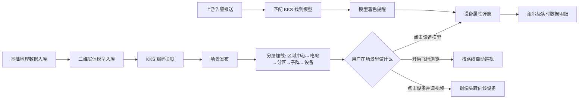
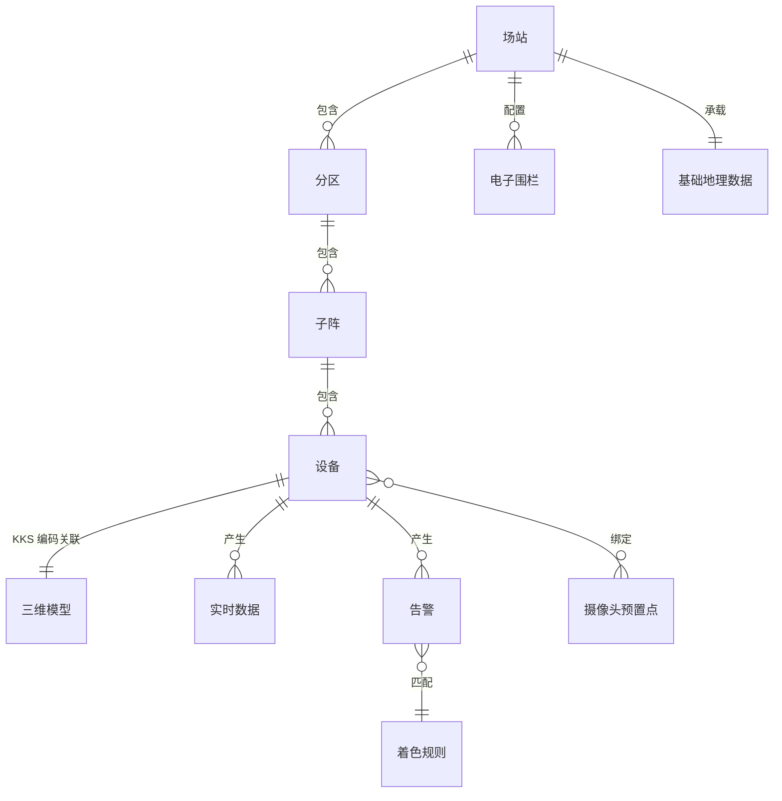

# 新能源场站数字孪生集成平台 · 数字孪生可视化 需求规格说明书

| 项 | 内容 |
| --- | --- |
| 文档版本 | V1.0 |
| 编制人 | （示例文档，未指定编制人） |
| 编制日期 | 2026-07-31 |
| 文档密级 | 内部 |
| 资料依据 | [input/INDEX.md](../../input/INDEX.md)（共 1 份资料，未标注日期） |
| 读者对象 | **开发团队**——本文重点写透业务规则、状态流转、字段与边界 |
| 格式依据 | 无甲方既定模板可依，采用工作空间自带 PRD 模板 ⚠（→ Q23） |

> **本文只覆盖「数字孪生可视化」一个模块**——即三维建模成果在平台上的消费侧：
> 场景加载与浏览、设备属性与实时数据、告警着色、飞行巡视、能量流向、视频联动、电子围栏渲染。
> 人员定位类功能、风电场部分、第 3 章特色功能尚不具备成文条件，
> 原因见 [需求拆解.md §明确待补](../analysis/需求拆解.md) 与决策 [0001](../decisions/0001-PRD首版只覆盖数字孪生可视化模块.md)、[0002](../decisions/0002-人员定位类功能暂缓至个人信息合规方案明确.md)。

---

## 0. 未决问题汇总

**评审时先过这张表。** 表里还有未确认项，说明相关章节的规则可能变动。
完整清单见 [open-questions.md](../analysis/open-questions.md)。

| # | 问题 | 影响范围 | 责任人 | 状态 |
| --- | --- | --- | --- | --- |
| Q1 | 资料文首六项元信息自标「假定」，真实值是什么 | 全文的范围与规模前提 | 商务负责人 | 待确认 |
| Q2 | 性能指标（首屏加载、帧率、并发、刷新周期、单场景模型量） | §7 全部、§4.1、§4.3 | 甲方技术对口人 | 待确认 |
| Q3 | 4 座风电场的模型层级、监视对象、告警粒度 | §2.1 / §2.2 范围边界 | 甲方生产部门 | 待确认 |
| Q4 | 各类模型交付到哪一档 LOD；「1:1 还原」与精度表如何统一 | §4.10、§6.1、§8 | 甲方 + 承建方技术负责人 | 待确认 |
| Q5 | 人员位置与个人信息的合规方案 | §2.2 不做项、§4.9 | 甲方法务 / 信息安全 | 待确认 |
| Q8 | 附录 D 模型编码规范；既有 KKS 编码库编到哪一级 | §4.10、§6.1 | 甲方生产部门 | 待确认 |
| Q9 | 生产运行智能管理系统的接口现状与数据项 | §4.2、§4.3、§6 | 甲方系统负责人 | 待确认 |
| Q10 | 视频安防系统、工单系统、移动端应用的接口现状 | §4.8、§2.3 | 甲方各系统负责人 | 待确认 |
| Q15 | 告警着色的上游告警来源、级别定义与颜色映射规则 | §4.4 全部规则 | 甲方生产部门 | 待确认 |
| Q16 | 「组串级」的实际规模量级 | §4.3、§6.1、§7 | 甲方生产部门 | 待确认 |
| Q23 | 甲方是否有规定的文档格式 | 全文格式 | 甲方 / 商务 | 待确认 |

## 1. 背景与目标

### 1.1 业务背景

电站管理层级多、信息分散，运营管理层与运维作业层之间缺少高效联动手段；
标准化、精益化运维作业难以落地；场区大、分布广，安全隐患难以及时洞察；
告警发生后定位设备、派单、到达现场各环节割裂，消缺过程不透明。
（来源：`新能源场站数字孪生集成平台方案建议书.md` 开篇第 1–2 段）

数字孪生可视化是整个平台的**第一环**：三维建模的成果只有被它消费，才产生业务价值；
告警着色、飞行巡视、视频联动、路径导航也都以它提供的场景为容器。
**它不成立，平台其余部分都无处安放。**

### 1.2 目标与成功标准

| 目标 | 成功标准 | 状态 |
| --- | --- | --- |
| 让管理者在场景里掌握全站状态 | 从区域中心到组串五级可下钻，任一层级可见运行状态 | ⚠ 无加载时间与帧率要求，不可验收（→ Q2） |
| 用「点模型看数据」替代多系统切换 | 点击任一设备模型即可看到台账与实时数据 | ⚠ 数据源接口现状未知（→ Q9） |
| 告警在场景中一眼可见 | 组串级故障在三维场景中变色提醒 | ⚠ 上游告警来源未定（→ Q15） |
| 三维场景真实反映物理电站 | 「1:1 镜像还原」 | ⚠ 与精度表互斥、不可测量（→ Q4，见决策 0003） |

> ⚠ **待确认**：本节四项成功标准目前**全部不可验收**。
> 资料唯一的量化指标是建模精度，没有一条描述系统上线后应达成什么业务结果。
> 这是本模块最大的交付风险。（→ Q2、Q4）

### 1.3 目标用户

| 角色 | 描述 | 核心诉求 | 使用频次 |
| --- | --- | --- | --- |
| 运营管理人员 | 区域 / 集团层面查看多站运行态势 | 一屏看清哪个站有问题 | 每日 |
| 运维值班人员 | 值班期间监视所辖场站 | 告警能在场景里立刻定位 | 常驻 |
| 远程集中管控人员 | 通过视频远程核实现场情况 | 点设备就能调出对应画面 | 按需 |
| 三维数据工程师 | 维护模型、编码与场景配置 | 模型与设备的关联可校验 | 按需 |
| 安全管理人员 | 维护电子围栏等安全边界配置 | 边界改动可追溯 | 按需 |

> `[推断]` 上述角色划分来自新能源场站的通行岗位设置，**资料未出现任何角色定义**，
> 也未出现任何权限描述。需在项目启动会确认（→ Q18）。

## 2. 范围

### 2.1 本期范围

| 模块 | 功能 | 需求 ID | 优先级 | 优先级状态 |
| --- | --- | --- | --- | --- |
| 三维可视化 | 三维场景分层加载与基本操作 | R-可视-001 | P0 | 建议值 |
| 运行可视化 | 设备属性查看 | R-运行-001 | P0 | 建议值 |
| 运行可视化 | 组串级实时数据查看 | R-运行-002 | P0 | 建议值 |
| 三维可视化 | 告警状态模型着色 | R-可视-005 | P1 | 建议值 |
| 三维可视化 | 飞行视角巡视 | R-可视-003 | P1 | 建议值 |
| 三维可视化 | 能量流向模拟 | R-可视-004 | P1 | 建议值 |
| 三维可视化 | 场景效果动态变换 | R-可视-002 | P2 | 建议值 |
| 视频安防集成 | 摄像头预置点管理与设备联动 | R-视频-001 | P1 | 建议值 |
| 虚拟电子围栏 | 围栏渲染与配置 | R-围栏-001 | P2 | 建议值 |
| 建模（依赖项） | 模型与设备的 KKS 编码关联 | R-建模-003 | P0 | 建议值 |

> **全部优先级均为建议值，尚未经业务方拍板。** 依据写在 [需求拆解.md](../analysis/需求拆解.md) 各条目内。

### 2.2 本期明确不做

| 不做的内容 | 原因 | 计划何时做 |
| --- | --- | --- |
| 人员属性查看、位置同步、路径规划与导航、路径回放、到岗自动录像 | 员工位置轨迹属敏感个人信息，合规方案全空白 ⚠（→ Q5），见决策 0002 | 合规方案确认后单独出 PRD |
| 电子围栏的越界报警与处置闭环 | 越界判定依赖人员定位（Q5）；报警去向与处置流程未描述（Q14） | 同上 |
| 一键派单 | 工单系统未点名、接口未知 ⚠（→ Q10） | 接口明确后 |
| 4 座风电场的全部功能 | 正文对风电场零描述 ⚠（→ Q3） | 补齐资料后出 V2.0 |
| 知识图谱告警 AI 治理、多模态智能巡视、红外热斑识别与清洗策略 | 资料自标「(待完善)」，两项只有图或标题 ⚠（→ Q7） | 待定 |
| 应急沙盘推演、3D 实景指挥调度 | 写在开篇目标里，正文无任何设计 ⚠（→ Q17） | 待定 |
| 三维建模的外业采集与建模作业本身 | 本文档只写平台侧需求；采集与建模的范围归属未定（→ Q11） | 另立文档 |

> ⚠ 本表各项是**基于资料缺口做出的边界判断**，资料中没有任何排除项声明。
> 需业务方逐条确认（→ Q22）。**未经确认的边界不构成范围保护。**

### 2.3 依赖与前置条件

| 依赖项 | 类型 | 当前状态 | 责任方 | 风险 |
| --- | --- | --- | --- | --- |
| 三维模型交付成果（含 LOD 档位） | 数据 | ⚠ 档位未锁定（Q4） | 承建方建模团队 | 高：本模块全部功能的载体 |
| KKS 编码库 | 数据 | ⚠ 是否已有、编到哪级未知（Q8） | 甲方生产部门 | 高：无编码则「点模型看数据」不成立 |
| 附录 D 模型编码规范 | 文档 | ⚠ 资料未附（Q8） | 方案编制人 | 高：关联规则的唯一依据 |
| 生产运行智能管理系统接口 | 外部接口 | ⚠ 未知（Q9） | 甲方系统负责人 | 高：运行可视化的唯一数据来源 |
| 告警数据来源 | 外部接口 | ⚠ 未指明来源系统（Q15） | 甲方生产部门 | 高：无告警源则 §4.4 为空壳 |
| 视频安防系统接口 | 外部接口 | ⚠ 未知（Q10） | 甲方 | 中：仅影响 §4.8 |
| 基础地理数据（DEM/DOM/倾斜摄影/矢量） | 数据 | ⚠ 采集归属未定（Q11） | 待定 | 高：场景底座 |
| 空间数据引擎（关系数据库） | 环境 | ⚠ 未知 | 甲方 / 承建方 | 中：地理数据的存储载体 |

> **8 项依赖，8 项状态未知。** 这是当前进度的最大不确定来源（→ Q9、Q10、Q11）。

## 3. 业务流程

### 3.1 整体流程

### 3.2 关键分支与异常流程

| 分支 | 触发条件 | 系统行为 |
| --- | --- | --- |
| 模型未关联设备 | 点击的模型没有对应 KKS 或编码在业务库中查不到 | 弹窗提示「该模型未关联设备」，并给出模型编号供数据工程师排查；**不弹空白窗** |
| 设备无实时数据 | 接口可达但该设备未接入 | 属性区正常展示，实时数据区显示「未接入」，并标注接入状态字段 |
| 数据源不可达 | 生产运行智能管理系统接口超时或报错 | 场景仍可浏览；实时数据区显示故障提示并区分「数据源故障 / 查询故障」，给重试入口 |
| 数据过期 | 实时数据时间戳超过约定时限未更新 | 显式标注「数据过期 + 最后更新时间」，**不得沿用旧值伪装成实时** |
| 告警找不到模型 | 上游告警的 KKS 在模型库中不存在 | 记入「未着色告警」清单并给出计数，**不得静默丢弃** |
| 某层级数据缺失 | 分区或子阵层的模型未入库 | 加载到上一可用层级并提示缺哪一层，不静默留空 |
| 摄像头调用失败 | 摄像头离线或转向超时 | 明确提示失败原因，**不停留在上一画面伪装成成功** |

## 4. 功能需求

### 4.1 三维场景分层加载与基本操作（R-可视-001）

**用户目标**：运营管理人员在浏览器里打开场景，从区域中心一路下钻到某个设备，全程流畅。

**来源**：`新能源场站数字孪生集成平台方案建议书.md` §2.1 三维可视化

**业务规则**

1. 渲染基于 **WebGL 协议的自有 3D 引擎**，在主流浏览器内直接展示，不安装插件
   （来源：§2.1 三维场景制作加载）。
2. 场景按 **五级分层加载**：区域中心 → 电站 → 分区 → 子阵 → 设备。
   每一级只加载当前视野所需的资源，不一次性加载全部模型。
3. 各类资源图层（地形、影像、实体模型、线路、标签）可独立加载、管理与开关。
4. 站内常规设备提供精细化模型的渲染展示（来源：§2.1 站内设备精细展示）。
5. 基本操作至少提供：放大、缩小、平移（来源：§2.1 三维场景基本操作）。
6. 加载过程必须有进度反馈；某一层级模型缺失时**提示缺哪一层**，不静默留空。
7. 下钻与返回的层级路径需可见（面包屑），任一层级可直接跳回。

**层级与内容对应**

| 层级 | 场景内容 | 可交互对象 | 数据挂载 |
| --- | --- | --- | --- |
| 区域中心 | 多站分布、地形底图 | 电站图标 | 各站汇总状态 |
| 电站 | 全站地形 + 建筑 + 场区边界 | 分区、升压站 | 全站运行概况 |
| 分区 | 分区范围内的方阵布置 | 子阵、箱变 | 分区出力 |
| 子阵 | 子阵内组串与设备布置 | 逆变器、汇流箱、组串 | 子阵出力 |
| 设备 | 单体设备精细模型 | 设备本体 | 设备台账 + 实时数据 |

> ⚠ 上表的层级内容划分是**基于资料「区域中心→电站→分区→子阵→设备」一句话的展开**，
> 具体每层放什么资料未定义，需业务方确认。

**四类状态**

| 状态 | 表现 |
| --- | --- |
| 空态 | 某场站尚未发布场景时提示「该站场景未发布」+ 发布进度，不展示空白画布 |
| 加载中 | 分级加载进度（当前层级 / 已加载资源比例）；**保留已加载层级，不清空画面** |
| 错误 | 场景资源加载失败时提示失败的资源类型并给重试；地形可用而模型不可用时降级展示地形 |
| 无权限 | 无权限场站**不出现在区域中心的可选列表中**（隐藏） |

**验收标准**

1. 主流浏览器内无插件展示 3D 场景与模型
2. 五级分层加载可逐级下钻与返回，层级路径可见
3. 图层可独立开关，开关状态在会话内保持
4. 提供放大、缩小、平移操作
5. 某层级模型缺失时显式提示缺失层级，其余层级仍可用
6. `⛔ 阻塞于 Q2` ——首屏加载时间、渲染帧率、并发在线人数未定义，本节暂无性能类验收条款

**未决**：⚠ 性能指标（→ Q2）；⚠ 单场景可承载的模型量上限（→ Q2、Q16）

### 4.2 设备属性查看（R-运行-001）

**用户目标**：点击场景中的设备，立刻看到它是什么、谁家的、什么时候装的、有没有接入。

**来源**：`新能源场站数字孪生集成平台方案建议书.md` §2.2 运行可视化 · 设备属性查看

**业务规则**

1. 点击设备模型或其标签，弹出该设备的详情窗。
2. 详情窗分两组展示：**设备基础数据**与**设备实时数据**（实时部分见 §4.3）。
3. 基础数据取自生产运行智能管理系统，**以 KKS 编码为关联键**（依赖 §4.10）。
4. 详情窗需展示数据更新时间；基础数据与实时数据的更新时间**分别标注**，不共用一个。
5. 维护记录与维护人员在详情窗内可见（来源：§2.2「便于管理员查看设备厂家、设备类型、
   维护记录、维护人员等信息」）。
6. 模型未关联设备、或编码在业务库中查不到时，提示「该模型未关联设备」并给出模型编号，
   **不弹空白窗**。

**字段定义**（设备基础数据）

| 字段 | 类型 | 必填 | 长度/范围 | 默认值 | 校验规则 | 说明 |
| --- | --- | --- | --- | --- | --- | --- |
| KKS 编码 | 字符串 | 是 | 1–64 | — | 须存在于 KKS 编码库 | 模型与设备的唯一关联键 |
| 设备名称 | 字符串 | 是 | 1–100 | — | — | 如「69#方阵箱变」 |
| 设备类型 | 枚举 | 是 | — | — | 取自设备分类字典 | 箱变 / 逆变器 / 汇流箱 / 组串 等 |
| 厂商名称 | 字符串 | 否 | 0–100 | 空 | — | 设备制造厂商 |
| 安装日期 | 日期 | 否 | — | 空 | — | — |
| 运行日期 | 日期 | 否 | — | 空 | ≥ 安装日期 | 投运日期 |
| 接入状态 | 枚举 | 是 | — | 未接入 | 已接入 / 未接入 | 决定实时数据区的表现 |
| 所属子阵 | 字符串 | 是 | 1–50 | — | — | 由 KKS 解析或由台账给出 |
| 所属场站 | 字符串 | 是 | 1–50 | — | — | 同上 |
| 维护记录 | 列表 | 否 | — | 空 | — | ⚠ 展示条数与排序未定 |
| 维护人员 | 字符串 | 否 | 0–50 | 空 | — | ⚠ 属个人信息，展示范围需确认（→ Q5） |
| 数据更新时间 | 时间 | 是 | — | — | — | 基础数据的更新时刻 |

> ⚠ 上表字段以资料描述与同类产品截图所载条目为基础整理，
> **最终以生产运行智能管理系统实际提供的接口字段为准**（→ Q9）。

**四类状态**

| 状态 | 表现 |
| --- | --- |
| 空态 | 模型未关联设备时提示「该模型未关联设备」+ 模型编号，供数据工程师排查 |
| 加载中 | 弹窗骨架占位；已取到的基础数据先展示，实时数据后到 |
| 错误 | 区分「数据源故障」与「查询故障」并给重试；场景本身不受影响 |
| 无权限 | 无权限查看该场站设备时不响应点击，并提示所需权限，不弹半截数据 |

**验收标准**

1. 点击设备模型弹出详情窗，展示上表中全部必填字段
2. 基础数据与实时数据的更新时间分别标注
3. 维护记录与维护人员在详情窗内可见
4. 模型未关联设备时显式提示并给出模型编号，不弹空白窗
5. 接口故障时区分故障类型并提供重试，场景浏览不中断

**未决**：⚠ 接口实际字段（→ Q9）；⚠ 维护人员姓名的展示范围（→ Q5）；⚠ 维护记录展示条数与排序

### 4.3 组串级实时数据查看（R-运行-002）

**用户目标**：运维值班人员实时掌握设备运行情况，最小能看到组串。

**来源**：`新能源场站数字孪生集成平台方案建议书.md` §2.2 运行可视化 · 设备实时数据查看

**业务规则**

1. 实时数据可查看的**最小单元为组串**（来源：§2.2「可供查看的最小单元为组串」）。
2. 实时数据项至少包含设备状态与电气量明细；具体数据项**以接口实际提供的为准**（→ Q9）。
   资料所示条目为：设备状态、有功功率、无功功率、功率因数、电网频率、油温。
3. 数据必须带时间戳。超过约定时限未更新时标注「数据过期 + 最后更新时间」，
   **不得沿用旧值伪装成实时**。约定时限 ⚠ 待定（→ Q2）。
4. 设备接入状态为「未接入」时，实时数据区显示「未接入」，不显示 0 值。
5. 无数值的项统一显示为「-」，与数值 0 明确区分。
6. 从子阵下钻到组串时，组串列表按编号排序，异常组串排在前。

**字段定义**（设备实时数据）

| 字段 | 类型 | 必填 | 长度/范围 | 默认值 | 校验规则 | 说明 |
| --- | --- | --- | --- | --- | --- | --- |
| 设备状态 | 枚举 | 是 | — | — | 正常 / 告警 / 停机 / 未接入 | 驱动 §4.4 的着色 |
| 有功功率 | 数值 | 否 | — | 空 | — | 无值显示「-」 |
| 无功功率 | 数值 | 否 | — | 空 | — | 同上 |
| 功率因数 | 数值 | 否 | -1–1 | 空 | — | 同上 |
| 电网频率 | 数值 | 否 | — | 空 | — | 同上 |
| 油温 | 数值 | 否 | — | 空 | — | 仅箱变 / 主变类设备有此项 |
| 数据时间戳 | 时间 | 是 | — | — | — | 精确到秒 |
| 是否过期 | 布尔 | 是 | — | 否 | 由时间戳与约定时限判定 | 为是时界面显式标注 |

**验收标准**

1. 可下钻查看的最小单元为组串
2. 实时数据带时间戳，超时未更新时标注「数据过期」
3. 未接入设备显示「未接入」，不显示 0 值；无值项显示「-」
4. 数据源不可达时区分故障类型并提示，不显示空表
5. `⛔ 阻塞于 Q2` 刷新周期未定；`⛔ 阻塞于 Q16` 组串总量未知，性能类条款待补

**未决**：⚠ 刷新周期与「过期」判定时限（→ Q2）；⚠ 组串规模量级（→ Q16）；⚠ 接口实际数据项（→ Q9）

### 4.4 告警状态模型着色（R-可视-005）

**用户目标**：值班人员在场景里一眼看出哪里出了问题，不必先去别的系统查告警列表。

**来源**：`新能源场站数字孪生集成平台方案建议书.md` §2.6 设备实时告警会映射到对应模型

**业务规则**

1. 着色粒度支持到**组串级**（来源：§2.6「支持到组串级的故障告警着色渲染」）。
2. 提供数字孪生配置界面，可为**不同级别、不同类型**的告警分别设置模型渲染颜色
   （来源：§2.6）。
3. 告警恢复后模型颜色**自动复原**，不需要人工清除。
4. 同一模型同时命中多条告警时，按级别取最高级着色；悬停提示中列出全部命中的告警。
5. **颜色不作为唯一区分手段**：着色模型旁需同时给出文字标识
   （新增建议，资料未涉及；理由是大屏色偏与色觉障碍下颜色不可靠）。
6. 告警的 KKS 在模型库中不存在时，记入「未着色告警」清单并给出计数，**不得静默丢弃**。
7. 着色状态随场景层级聚合：下层有告警时，上层对应对象也需给出提示，避免下钻才发现。

**着色配置项**

| 配置项 | 类型 | 必填 | 说明 |
| --- | --- | --- | --- |
| 告警级别 | 枚举 | 是 | ⚠ 级别定义未知（→ Q15） |
| 告警类型 | 枚举 | 是 | ⚠ 类型清单未知（→ Q15） |
| 渲染颜色 | 颜色 | 是 | 支持自定义 |
| 文字标识 | 字符串 | 是 | 1–10 字，与颜色并用 |
| 是否闪烁 | 布尔 | 否 | 默认否；建议仅最高级别启用 |
| 生效层级 | 多选 | 是 | 在哪些场景层级上着色 |

**验收标准**

1. 着色粒度到组串级
2. 可按告警级别与类型分别配置渲染颜色，配置即时生效
3. 告警恢复后颜色自动复原
4. 多条告警命中同一模型时取最高级着色，悬停可见全部告警
5. 着色同时提供文字标识，不依赖颜色单一通道
6. 未匹配到模型的告警进入「未着色告警」清单并计数
7. `⛔ 阻塞于 Q15` ——上游告警来源、级别与类型清单确定后，规则 1、2 才能形成完整验收条款

**未决**：⚠ 告警来源系统、级别定义、类型清单（→ Q15）；
⚠ 验收标准 5 与规则 5、6、7 是我方提出的建议，资料未涉及，需甲方确认

### 4.5 飞行视角巡视（R-可视-003）

**用户目标**：不用到现场，按固定路线把全站看一遍。

**来源**：`新能源场站数字孪生集成平台方案建议书.md` §2.3 飞行视角模拟

**业务规则**

1. 支持**上帝视角**与**第一视角**两种飞行浏览方式。
2. 飞行路线可定制，可覆盖电站、分区、子阵各层级。
3. 巡视过程中可查看途经分区、子阵下的设备运行状态。
4. 支持随时开启与关闭飞行浏览；**关闭后停留在当前视角**，不跳回初始位置。
5. 飞行过程中若途经对象存在告警，需保持 §4.4 的着色与提示，不因飞行而屏蔽。

**验收标准**

1. 两种视角均可用且可切换
2. 飞行路线可定制并保存，可覆盖三个层级
3. 巡视中可查看途经设备的运行状态
4. 可随时开启 / 关闭，关闭后视角不跳变

**未决**：⚠ 巡视是否需要形成巡视记录 / 报告？资料只写「在线巡视」，未提产物

### 4.6 能量流向模拟（R-可视-004）

**用户目标**：直观感受电站当前的生产运行状态。

**来源**：`新能源场站数字孪生集成平台方案建议书.md` §2.4 能量流向模拟

**业务规则**

1. 集电线杆塔与场内输电线路按 1:1 还原并在场景中可见。
2. 能量流动效果覆盖「光伏区 → 升压站」全链路。
3. 流动效果由**实时数据驱动**（依赖 §4.3）：出力为零时不得仍显示流动。
4. 数据不可用时，线路仍展示但流动效果停止，并标注「数据不可用」，
   **不得用静态动画伪装成有出力**。

**验收标准**

1. 集电线路与杆塔在场景中可见
2. 流动效果覆盖光伏区到升压站全链路
3. 出力为零或数据不可用时流动停止并有标注

**未决**：⚠ 流动速度 / 粗细是否映射实际功率大小、映射规则由谁定；
⚠ 风电场的能量流向如何表达（→ Q3）

### 4.7 场景效果动态变换（R-可视-002）

**用户目标**：让虚拟场景与实际场地情况一致。

**来源**：`新能源场站数字孪生集成平台方案建议书.md` §2.1 三维可视化 · 场景效果动态变换

**业务规则**

1. 支持昼夜场景效果的模拟与实时切换。
2. 支持天气场景效果的模拟与实时切换。
3. 切换过程**不中断场景中的实时数据展示**。

**验收标准**

1. 昼夜、天气两类效果均可模拟并实时切换
2. 切换过程中实时数据展示不中断

**未决**：`⛔ 阻塞于 Q13` ——天气是接真实气象数据自动切换还是仅手动切换？
前者需新增气象数据源接口与相应验收条款

### 4.8 摄像头预置点管理与设备联动（R-视频-001）

**用户目标**：点哪个设备，摄像头就转到哪个设备，不必在视频系统里手动找机位。

**来源**：`新能源场站数字孪生集成平台方案建议书.md` §2.8 集成视频安防系统

**业务规则**

1. 支持摄像头**全局调控**与**定位巡视**。
2. 提供**预置点管理**：可为设备模型绑定摄像头预置点，一个设备可绑定多个预置点。
3. 点击某设备模型时，绑定的摄像头转向对准该设备，视频画面在场景内可见。
4. 摄像头离线或转向超时时**明确提示失败**，不停留在上一画面伪装成成功。
5. 多人同时调用同一摄像头时的抢占规则 ⚠ 未定义（资料未涉及）。
6. 「人员到达作业范围自动开启录像」**不在本期范围**（见 §2.2 与决策 0002）。

**验收标准**

1. 摄像头可全局调控与定位巡视
2. 设备模型可绑定预置点，绑定关系可维护
3. 点击设备后摄像头按绑定预置点转向，画面在场景内可见
4. 摄像头离线或转向失败时显式提示失败原因

**未决**：⚠ 并发抢占规则；⚠ 「红外识别」的具体形态（资料只有一个词）；⚠ 视频接口现状（→ Q10）

### 4.9 虚拟电子围栏渲染与配置（R-围栏-001）

**用户目标**：把安全边界画在场景里，让它看得见、改得动、查得到。

**来源**：`新能源场站数字孪生集成平台方案建议书.md` §2.5 虚拟电子围栏

**业务规则**

1. 支持在场景中配置围栏范围，并以可见方式渲染安全边界。
2. 围栏可启用 / 停用，可按时段生效。
3. 围栏配置变更**留痕**：谁改的、什么时间、改成什么，可查询。
4. **越界报警与智能录像不在本期范围**——它依赖人员 GPS 定位（→ Q5），
   且报警去向与处置闭环未描述（→ Q14）。见 §2.2 与决策 0002。

**验收标准**

1. 围栏范围可配置并在场景中可见
2. 围栏可启用 / 停用，可按时段生效
3. 配置变更留痕可查

**未决**：⚠ 与既有周界安防系统是替代还是并存（→ Q14）

### 4.10 模型与设备的 KKS 编码关联（R-建模-003，本模块依赖项）

本模块全部「点模型看数据」类功能都建立在 KKS 编码关联之上，规则见
[需求拆解.md R-建模-003](../analysis/需求拆解.md)。此处只强调对本模块的约束：

1. 每个可交互模型必须有且只有一条 KKS 编码。
2. 关联结果需可校验：系统提供「未关联模型」与「未关联设备」两张差异清单。
3. 编码规范以《GB/T 50549-2010》《QSPI 9720-2016》及**附录 D**为准
   ——⚠ 附录 D 资料未附（→ Q8）。

## 5. 权限矩阵

> ⚠ **资料没有任何权限描述。** 本节全部为我方提出的建议，需业务方确认（→ Q18）。

| 功能 | 运营管理人员 | 运维值班人员 | 远程集中管控 | 三维数据工程师 | 安全管理人员 |
| --- | --- | --- | --- | --- | --- |
| 浏览场景（§4.1） | ✅ | ✅ | ✅ | ✅ | ✅ |
| 设备属性查看（§4.2） | ✅ | ✅ | ✅ | ✅ | ✅ |
| 实时数据查看（§4.3） | ✅ | ✅ | ✅ | ✅ | — |
| 告警着色配置（§4.4） | — | — | — | ✅ | — |
| 飞行路线定制（§4.5） | ✅ | — | ✅ | ✅ | — |
| 摄像头调控（§4.8） | — | ✅ | ✅ | — | ✅ |
| 预置点绑定（§4.8） | — | — | — | ✅ | — |
| 围栏配置（§4.9） | — | — | — | — | ✅ |
| 模型与编码维护（§4.10） | — | — | — | ✅ | — |

**权限表现约定**：

- **数据权限**（无权限场站）→ 隐藏，不出现在可选列表中
- **操作权限**（无权限按钮）→ 置灰并提示所需角色，不隐藏；隐藏会让用户以为功能不存在

## 6. 数据需求

### 6.1 核心数据实体与关系

| 实体 | 权威源 | 说明 |
| --- | --- | --- |
| 场站 / 分区 / 子阵 / 设备 | 生产运行智能管理系统 ⚠（→ Q9） | 台账与层级结构 |
| 三维模型 | 本平台 | 建模成果，按 LOD 档位交付 ⚠（→ Q4） |
| KKS 编码 | 甲方编码库 ⚠（→ Q8） | 模型与设备的唯一关联键 |
| 实时数据 | 生产运行智能管理系统 ⚠（→ Q9） | 本平台只读、不落权威库 |
| 告警 | ⚠ 来源系统未指明（→ Q15） | 本平台只做渲染，不产生告警 |
| 着色规则 / 预置点绑定 / 电子围栏 | 本平台 | 本平台自有配置数据 |
| 基础地理数据 | 空间数据引擎 | DEM / DOM / 倾斜摄影 / 矢量 |

> **本平台对业务数据只读。** 设备台账、实时数据、告警均不在本平台内编辑，
> 避免与权威源不一致。本平台仅拥有场景配置类数据的写权限。

### 6.2 存量数据与迁移

- `[空白]` 资料未提及任何存量数据迁移要求。
- 需要迁入的只有三维成果与地理数据，属建设内容而非迁移，见 R-建模-001/002。
- ⚠ 既有 KKS 编码库若已存在，需确认导入方式与增量同步机制（→ Q8）。

### 6.3 统计与报表口径

- `[空白]` 资料未提出任何统计或报表要求。
- 本模块建议至少内置两项**运维自检口径**（我方建议，资料未涉及）：
  1. 模型关联完整率 = 已关联 KKS 的可交互模型数 ÷ 可交互模型总数
  2. 未着色告警率 = 未匹配到模型的告警数 ÷ 告警总数

## 7. 非功能需求

| 维度 | 要求 | 状态 |
| --- | --- | --- |
| 首屏加载时间 | — | ⚠ **未定义**（→ Q2） |
| 渲染帧率 | — | ⚠ **未定义**（→ Q2） |
| 并发在线人数 | — | ⚠ **未定义**（→ Q2） |
| 实时数据刷新周期 | — | ⚠ **未定义**（→ Q2） |
| 单场景可承载模型量 | — | ⚠ **未定义**（→ Q2、Q16） |
| 可用性 | — | ⚠ **未定义** |
| 浏览器兼容范围 | 资料只写「可在移动设备和网络浏览器上运行」 | ⚠ 具体浏览器与版本未定 |
| 个人信息合规 | — | ⚠ **未定义**，人员相关功能已整体暂缓（→ Q5，决策 0002） |
| 测绘与地理数据涉密 | — | ⚠ **未定义**，影响地理数据的存储与访问控制（→ Q6） |
| 等保定级 | — | ⚠ **未定义** |
| 操作留痕 | 本文自行约定：场景配置类操作（着色规则、预置点、围栏）全部留痕 | 我方建议，待确认 |
| 可访问性 | 本文自行约定：状态不依赖颜色单一通道传达 | 我方建议，待确认 |

> ⚠ **本章 11 项中 10 项无要求可写。** 数字孪生是重渲染 + 重数据的系统，
> 性能不定义等于架构无从设计；而测绘涉密与个人信息两项属合规红线，
> 不是「后面再补」的事项。这是本文档最大的空白（→ Q2、Q5、Q6）。

## 8. 风险与遗留问题

| 风险 | 依据 | 影响 | 应对 |
| --- | --- | --- | --- |
| 元信息全为「假定」 | 资料文首明写 | 范围与工作量基数不可用 | 先核实再排期（Q1） |
| 建模验收口径矛盾 | 「1:1 还原」vs 精度表；精度表与正文对不上 | 最大单项成本成为开口条款 | 见决策 0003，逐类锁档位（Q4） |
| 风电场零需求 | 正文功能全为光伏概念 | 约 1/3 覆盖资产无文档 | 本期不写，补资料后出 V2.0（Q3） |
| 唯一数据源接口未知 | 生产运行智能管理系统仅有名字 | §4.2、§4.3 可能整体延期 | 尽早联调（Q9） |
| 告警来源未指明 | 资料只说「设备实时告警」 | §4.4 可能是空壳 | 确认来源系统与级别定义（Q15） |
| 无任何性能指标 | 全文检索无相关数字 | 重渲染系统无约束可依 | 评审前必须补（Q2） |
| 人员数据合规空白 | 位置、录像、姓名均无合规描述 | 相关功能不能开发 | 已整体暂缓（Q5，决策 0002） |
| 测绘成果涉密要求空白 | 航拍与遥感数据无任何合规描述 | 数据采集方案可能被推翻 | 立项前确认（Q6） |

## 9. 需求追溯矩阵

| 本文章节 | 需求 ID | 来源资料位置 | 状态 |
| --- | --- | --- | --- |
| §4.1 | R-可视-001 | §2.1 三维可视化 | 部分阻塞（Q2） |
| §4.2 | R-运行-001 | §2.2 设备属性查看 | 部分阻塞（Q9） |
| §4.3 | R-运行-002 | §2.2 设备实时数据查看 | 部分阻塞（Q2、Q16） |
| §4.4 | R-可视-005 | §2.6 告警映射模型变色 | 部分阻塞（Q15） |
| §4.5 | R-可视-003 | §2.3 飞行视角模拟 | 待确认 |
| §4.6 | R-可视-004 | §2.4 能量流向模拟 | 待确认 |
| §4.7 | R-可视-002 | §2.1 场景效果动态变换 | 部分阻塞（Q13） |
| §4.8 | R-视频-001 | §2.8 集成视频安防系统 | 部分阻塞（Q10） |
| §4.9 | R-围栏-001 | §2.5 虚拟电子围栏 | 待确认（越界报警未纳入） |
| §4.10 | R-建模-003 | §1.2 设备与模型关联设计 | 部分阻塞（Q8） |
| §5 权限矩阵 | R-权限-001 | — | 新增建议（资料无权限描述） |
| §6.3 自检口径 | — | — | 新增建议（资料无统计要求） |
| §7 操作留痕、可访问性 | — | — | 新增建议（资料未涉及） |

## 附录

### A. 术语表

| 术语 | 含义 | 来源 |
| --- | --- | --- |
| DEM | 数字高程模型，反映一定分辨率的局部地形特征 | §1.1 |
| DOM | 数字正射影像图，兼具地图几何精度与影像特征，格式为 GeoTIFF | §1.1 |
| 倾斜摄影 | 同一飞行平台搭载多传感器，从一垂直四倾斜共五个角度采集影像 | §1.1 |
| SHP | Shapefile，常见矢量数据格式，至少含 .shp / .shx / .dbf 三个文件 | §1.1 |
| LOD | Level of Detail，模型细节层次，本项目分 LOD1 / LOD2 / LOD3 三档 | §1.2 |
| 几何模型 | 描述物理对象外形、尺寸、位置、结构等几何信息的三维模型 | §1.2 |
| 物理模型 | 由几何模型及其属性构成的三维模型 | §1.2 |
| KKS | 电厂标识系统，按功能、型号和安装位置标识发电厂中的系统、设备、组件与建构筑物 | §1.2 |
| 组串 | 光伏组件串联单元，本平台可视化与数据下钻的最小单元 | §2.2、§2.6、§2.7 |
| 子阵 | 场景分层加载的第四级，介于分区与设备之间 | §2.1 |

### B. 参考资料清单

| 资料 | 位置 | 说明 |
| --- | --- | --- |
| 新能源场站数字孪生集成平台方案建议书 | `input/converted/新能源场站数字孪生集成平台方案建议书.md` | 唯一资料；文首元信息自标「假定」 |
| GB/T 50549-2010 电站标识系统编码标准 | 未收录 | 资料引用，需另行获取 |
| QSPI 9720-2016 光伏发电站标识系统（KKS）编码规范 | 未收录 | 资料引用，需另行获取 |
| 附录 D 模型编码规范 | **缺失** | 正文引用但资料未附（→ Q8） |

### C. 变更记录

| 版本 | 日期 | 修改人 | 修改内容 |
| --- | --- | --- | --- |
| V1.0 | 2026-07-31 | （示例文档） | 首版：覆盖数字孪生可视化模块 10 项功能 |
