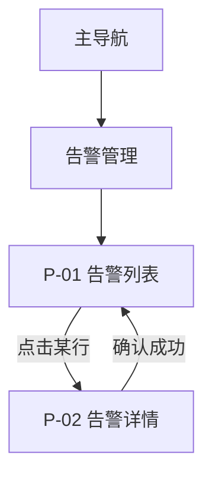

# 原型输入与 Axhub Make

阶段四。两步：先产出 `output/analysis/原型输入说明.md`，再启动 Axhub Make。

原型输入说明落盘之后**一并建一份产出物记录**（`kind: analysis`），走 [`pm-output-record`](../pm-output-record/SKILL.md)——它被原型吸收之后要能标成 `absorbed`，否则下一轮分不清哪份说明还作数。

手写 Markdown 的写法（front-matter 形态、标题层级、文档间链接、哪些语法现在先别用）见工作空间 `AGENTS.md` 的「Markdown 写法」一节，这里不复述。

**顺序不能颠倒。** 原型工具的产出质量完全取决于喂进去的需求描述有多具体。
直接说「帮我做个后台原型」得到的是通用模板，逐页改比重做还慢。
先把文档收敛成结构化的页面级描述，工具才能一次做对大部分。

## 和「单文件 HTML 原型」的边界

PM 之间有时会互传 **单个 `.html` 可点击稿**（评审前草稿、场景演示）。这类文件：

- 放进 `input/raw/`，由 `pm-doc-ingest` / `scripts/ingest.py` 入库：保留 HTML 供预览，
  并生成 `input/converted/<raw 相对目录>/_manifest_<名>.md`（校验 + 摘要），
  HTML 原件在同级 `SplittingObject/<名>/` 下。
- **不要**放进 `visualization/prototypes/`。别人给的 HTML 是**输入资料**，要留溯源；
  `visualization/prototypes/` 装的是本工作空间自己产出的成品页。
  （公开线上系统那类「收来看看别人怎么做」的页面走 `visualization/references/`，
  那是参考不是资料，见 AGENTS.md 阶段四。）
- **不要**在本技能里把 HTML「转写」成全套 PRD；可以在写原型输入说明时**引用**它
  （来源指到 converted 目录与 manifest），作为既有交互参考。

本技能只负责 **Axhub Make 路线** 的正式原型输入；HTML 单文件是输入资料，不是本阶段交付物。

## 第一步：写原型输入说明

读 `output/docs/` 里的 PRD 和 `output/analysis/需求拆解.md`。
PRD 是按功能组织的，原型是按页面组织的——**这一步的核心工作就是这次视角转换**。
一个功能可能横跨三个页面，一个页面可能承载五个功能，需要重新归集。

### 页面清单

```markdown
| 页面 ID | 页面名 | 所属模块 | 承载功能 | 用户角色 | 优先级 |
| --- | --- | --- | --- | --- | --- |
| P-01 | 告警列表 | 告警管理 | R-告警-001/002/003 | 运维 | P0 |
| P-02 | 告警详情 | 告警管理 | R-告警-003/004 | 运维 | P0 |
```

清单出来后做两个反向检查，这是漏页面的主要来源：

- **每条 P0 需求都落到页面上了吗？** 没落上的要么漏了页面，要么这条需求没有界面。
- **登录、权限不足、404、空数据引导这些页面想到了吗？** 主流程页面容易列全，
  这些边角页面几乎总被漏掉，但恰恰是评审时会被问到的。

### 信息架构

导航层级和页面间跳转关系。用 mermaid 画，工具能直接读懂：



### 主流程点击路径

**这一节决定原型的可点击性，是整份说明最关键的部分。**
挑 2–4 个核心任务，把完整路径逐步写出来，每步写清「在哪个页面、点什么、看到什么变化」：

```markdown
#### 流程一：运维确认一条严重告警
1. P-01 告警列表 → 默认按等级排序，严重告警红色标识
2. 点击某行 → 进入 P-02 告警详情
3. 详情页点「确认」→ 弹出确认弹窗，处理结论输入框（必填）
4. 填写后提交 → 提示「确认成功」，状态变为「已确认」，确认按钮置灰
5. 返回 P-01 → 该行状态已更新为「已确认」
```

写到这个颗粒度，原型才能真的点得通。只写「用户可以确认告警」，
生成出来的就是一个点不动的静态页面。

### 每页详情

每个页面写清这几项，直接决定生成出来的页面对不对：

- **页面目标**：用户来这个页面要完成什么（一句话）
- **信息优先级**：最重要的信息是什么，必须一眼看到；次要的可以折叠或放二级
- **字段/列**：列表写明列名、排序默认值、筛选项；表单写明字段、必填、校验规则
- **操作**：有哪些按钮，各自触发什么，哪些需要二次确认
- **四类状态**：空态 / 加载中 / 错误 / 无权限时页面长什么样
- **权限差异**：不同角色看到的页面有什么不同（隐藏还是置灰）

字段和规则直接从 PRD 的字段表搬，不要重新编。
枚举取值要给全——`状态：未确认/已确认/已归档` 才能生成出正确的筛选器和标签样式。

### 视觉与设计约束

有既有系统就说明要对齐的设计规范（`input/assets/` 里的界面截图是最好的依据，
Axhub Make 支持导入 Axure HTML、Figma 等既有资源作为参考）。
没有就说明行业和形态（「电力行业运维后台，数据密集，以表格为主，桌面端优先」）——
这类约束比「界面要好看」有用得多。

也要写清端形态：桌面 / 移动 / 响应式，以及最小支持分辨率。

## 第二步：交给 Axhub Make

**Axhub Make 服务端是后台常驻服务，不在本项目里启动。**
不要在 `visualization/prototypes/` 下跑 `npx @axhub/make`——用户会在 Axhub Make 页面上新建项目并指向本仓库的
`visualization/prototypes/`，它会自己在那里构建客户端目录，并自带 README 和结构。**那个目录不要动。**

`visualization/prototypes/` 下还可以有别的子目录（AI 生成的方案页、演示页，一个子目录一个 `index.html`，
见 AGENTS.md 阶段四），互不干扰。你在这一步的交付物是那份原型输入说明，
以及告诉用户：把 `output/analysis/原型输入说明.md` 作为需求输入喂给 Axhub Make。
有既有界面截图（`input/assets/`）或 Axure 文件的话，一并作为参考资源导入。

建议用户分批生成而不是一次全量：先做一个核心模块，确认风格和颗粒度对了再铺开。
第一批做对了，后面的一致性就有了参照。

## 第三步：回流

Axhub Make 的批注和 AI 评审会产出新信息，**必须写回 `output/`，不要只留在原型工具里**：

- 需求本身变了 → 更新 `output/docs/` 里的 PRD 对应章节
- 定了某个设计取舍 → 记一条 `output/decisions/`（含代价和谁拍的）
- 暴露新的未决问题 → 落成一条问题文件（见下节），`blocks` 填它卡住的那个交付物

原型阶段最容易发现需求漏洞——画出来才看得出流程断在哪。
这些发现如果只停在原型里，PRD 就和实际交付脱节了，
后面开发照 PRD 做、测试照 PRD 验，问题会重新冒出来。

## 发现未决问题怎么落

**走 [`pm-open-questions`](../pm-open-questions/SKILL.md)，不要自己发明格式。**
先看一眼 `output/`：

- 有 `output/questions/` 目录 → **一问一文件**，新建 `output/questions/Q<四位编号>.md`（编号取当前最大加一；**目录空不等于从 Q0001 起**，先查 git 历史用过的最大编号）
- 只有 `output/analysis/open-questions.md` → 旧工作空间，照旧往表格里追加，**不要擅自迁移结构**

新结构下每条必须填 `source`（触发这条问题的文档路径）与 `context`
（触发时在做什么，一句话）—— 溯源锚点挂在**条目**上，不挂在分节上。
`blocks` 填它阻塞的在途交付物，判断不了就写 `backlog`，不要瞎填。
`evidence` 与 `ai_*` 刚提问时留空；**查不到依据只能写 `我方推断`，且不能置 `answered`**。

**双通道：正文归正文，问题归问题。** 原型输入说明里不再放「待确认问题」表格，
要提就写一句「见 `questions/Q0134`」；问题条目里也不抄原型说明的正文。
同一条问题两处存在，很快就会对不上。


## Axhub Make 的五个阶段

工具本身是完整工作流，不只生成页面：生成 → 批注 → AI 评审 → 文档标注 → 发布
（在线链接 / 导出 HTML / 交付 Figma / 接回 Axure）。

对 PM 最有价值的是**批注**和**AI 评审**：批注锚定在具体页面元素上，
比散落在微信截图里的意见可追溯得多；AI 评审会拿原型对照规格检查需求覆盖度和交互一致性，
相当于评审会前先自查一轮。详见 <https://github.com/lintendo/Axhub-Make>。
